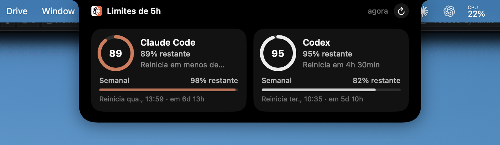

# Agent Island

Transforma o notch do MacBook numa "Dynamic Island" que mostra quanto ainda resta dos seus limites de uso do **Claude Code** e do **Codex**.



Clique no notch e um painel se abre com:

- a porcentagem restante da **janela de 5 horas** de cada ferramenta e quanto tempo falta para ela reiniciar
- o **limite semanal** de cada uma, com a data de reinício

Com o painel fechado, o notch fica com a aparência normal.

## Requisitos

- macOS 14 (Sonoma) ou mais recente
- Mac com Apple Silicon (M1 ou mais novo)
- Ferramentas de linha de comando do Xcode com Swift 6 ou mais recente. Se ainda não tiver, instale com:
  ```bash
  xcode-select --install
  ```
- Pelo menos um destes CLIs instalado e com login feito:
  - [Claude Code](https://docs.claude.com/en/docs/claude-code), com login via conta Claude (Pro/Max)
  - [Codex CLI](https://github.com/openai/codex), com login via conta ChatGPT

O app usa os logins que esses CLIs já salvaram no seu Mac. Não há nenhuma chave ou configuração extra.

## Instalação

```bash
git clone https://github.com/diegogontijo/dynamic-island-ai-agents.git
cd dynamic-island-ai-agents
./scripts/build.sh --install
```

O script compila o app, gera `build/AgentIsland.app`, copia para `/Applications` e abre. Para só compilar, sem instalar, rode `./scripts/build.sh` sem argumentos.

Na primeira execução:

- O macOS pode pedir permissão para acessar o item **"Claude Code-credentials"** do Keychain. Clique em **Permitir sempre**.
- O app é registrado para **abrir ao iniciar sessão**. Para desativar, use o menu da barra de menus.

## Uso

- **Clique no notch** para abrir o painel. Ele fecha ao clicar fora ou ao tirar o mouse de cima.
- O app não aparece no Dock. Ele fica como um **ícone na barra de menus**, com:
  - resumo dos dois limites, com o horário exato de reinício
  - abrir/fechar o painel
  - atualizar agora (⌘R)
  - abrir ao iniciar sessão
  - sair
- Os dados são atualizados a cada 3 minutos e sempre que o painel é aberto.
- O anel fica **amarelo** quando resta 25% ou menos e **vermelho** com 10% ou menos.

Em Macs ou monitores sem notch, o painel abre ao clicar no centro da barra de menus.

## Como funciona

| Ferramenta  | Credencial lida                                 | Endpoint consultado                         |
|-------------|-------------------------------------------------|---------------------------------------------|
| Claude Code | Keychain, item `Claude Code-credentials`        | `api.anthropic.com/api/oauth/usage`         |
| Codex       | `~/.codex/auth.json` (ou `$CODEX_HOME`)         | `chatgpt.com/backend-api/wham/usage`        |

São as mesmas fontes que o `/usage` do Claude Code e o `/status` do Codex usam, então os números batem com os deles.

Os tokens são **apenas lidos**: o app nunca os renova nem os modifica, então o login dos CLIs não é afetado. Nenhum dado é enviado para outro lugar além dos endpoints acima.

> Esses endpoints não são APIs públicas documentadas e podem mudar sem aviso.

## Solução de problemas

| Mensagem no painel                  | O que fazer                                                                                     |
|-------------------------------------|-------------------------------------------------------------------------------------------------|
| "Faça login no Claude Code / Codex" | Rode `claude` ou `codex` no terminal e faça login.                                              |
| "Login expirado — abra o …"         | O token venceu. Use o CLI correspondente uma vez para ele renovar o token e clique em atualizar. |
| "Muitas consultas…"                 | A API limitou as requisições. O app tenta de novo automaticamente.                               |

## Desinstalar

1. No ícone da barra de menus, desmarque **Abrir ao iniciar sessão** e clique em **Sair**.
2. Apague o app:
   ```bash
   rm -rf /Applications/AgentIsland.app
   ```

## Estrutura do projeto

```
Sources/AgentIsland/
├── main.swift                  # ponto de entrada
├── AppDelegate.swift           # inicialização do app
├── NotchController.swift       # janela sobre o notch, abrir/fechar, eventos de mouse
├── NotchViews.swift            # interface do painel (SwiftUI)
├── StatusItemController.swift  # ícone e menu da barra de menus, abrir ao iniciar sessão
├── UsageProviders.swift        # leitura das credenciais e chamadas às APIs
├── UsageStore.swift            # estado e atualização periódica
└── UsageModels.swift           # modelos de dados
scripts/build.sh                # compila, monta o .app, gera o ícone e instala
```
